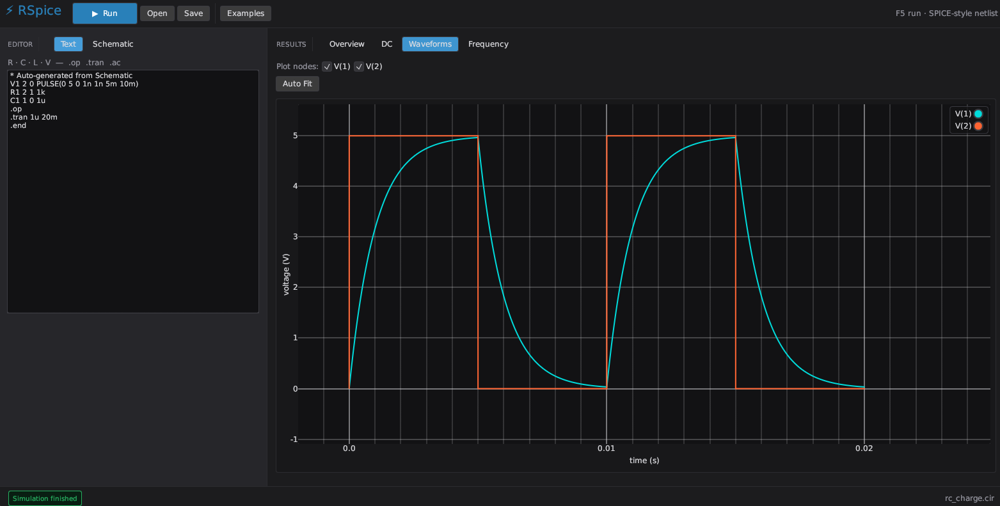
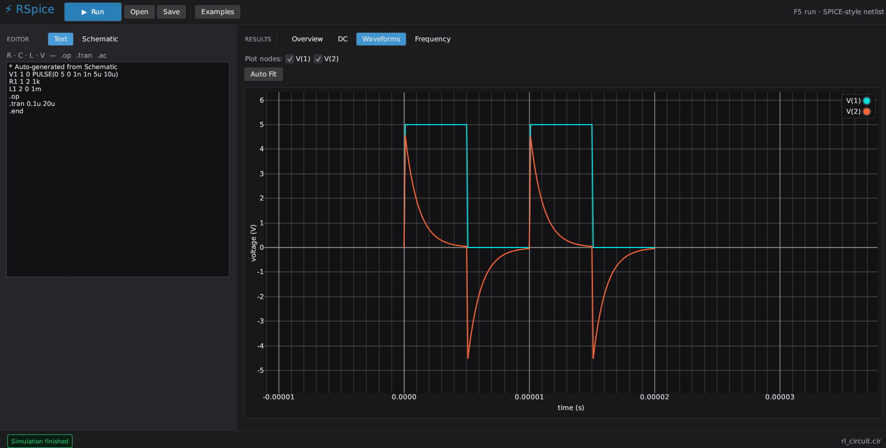
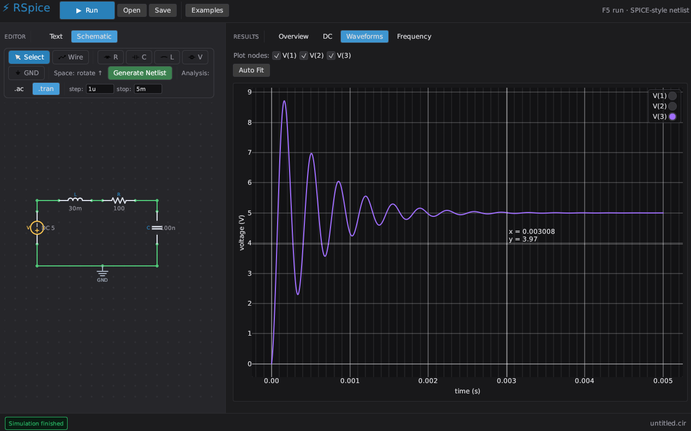

# RSpice

Analog circuit simulator in Rust, inspired by LTspice and PSpice. It uses **modified nodal analysis (MNA)** to solve linear circuits with:

- **R** — resistors  
- **C** — capacitors (transient, backward Euler)  
- **L** — inductors (transient, backward Euler)  
- **V** — DC voltage sources

## Screenshots
### RC circuit

### RL circuit

### Underdamped RLC circuit


## Quick start

To try it on your browser, visit https://siamsamix.github.io/rspice.web/

Alternatively, you can compile it and run on your desktop with the following commands,

```bash
git clone https://github.com/siamsamix/RSpice.git
cd RSpice
cargo run --release -p rspice    # graphical app
```

### GUI (`circuitsim-gui`)

Desktop app built with **egui** — dark theme, netlist editor, DC tables, and interactive waveform plots.

- **Run** or **F5** — simulate the current netlist  
- **Examples** — load RC, voltage divider, or RL circuits  
- **Open / Save** — netlist files (`.cir`)  
- Tabs: **Overview**, **DC**, **Waveforms** (zoomable plot)

```bash
cargo run --release -p circuitsim-gui
```

## Netlist format

SPICE-style text netlists:

| Element | Syntax | Example |
|---------|--------|---------|
| Resistor | `Rname n+ n- value` | `R1 1 2 1k` |
| Capacitor | `Cname n+ n- value` | `C1 2 0 1u` |
| Inductor | `Lname n+ n- value` | `L1 2 0 1m` |
| Voltage | `Vname n+ n- DC value` | `V1 1 0 DC 5` |

Node `0` is ground. Values support SI suffixes: `f p n u m k g t` (e.g. `1k`, `4.7u`).

### Analysis commands

- `.op` or `.dc` — DC operating point (resistors, voltage sources; L shorts, C open)  
- `.tran <tstep> <tstop> [tstart]` — transient simulation  

Lines starting with `*` or `;` are comments. End with `.end`.

## Example

```
* RC charging
V1 1 0 DC 5
R1 1 2 1k
C1 2 0 1u
.tran 10u 5m
.end
```

Export waveform as CSV:

```bash
cargo run --release -- examples/rc_charge.cir --csv > rc.csv
```

## Project layout

```
circuitsim/       Core library (parser, MNA, analyses)
circuitsim-cli/   Command-line runner
circuitsim-gui/   egui desktop application
examples/         Sample netlists
```

## Limitations (v0.1)

- ~~DC voltage sources only (no PULSE/SIN yet)~~
- No nonlinear devices (diodes, BJTs, MOSFETs)  
- No AC (.ac) or noise analysis  
- Dense matrix solver (fine for small/medium netlists)  

## License

MIT
